# B站关键词相关视频数据分析
## 项目简介
本项目主要对B站关键词相关视频进行数据分析，包括视频播放量、点赞量、评论量、投币量、分享量、收藏量等指标，并使用Python进行数据可视化。

## 数据来源
数据来源于B站API，通过关键词搜索获取相关视频的播放量、点赞量、评论量、投币量、分享量、收藏量等指标。

## 数据处理
使用Python对数据进行处理

## 数据可视化
参考ipynb笔记：<a href='analysis_dataset.ipynb'>卡拉彼丘视频数据分析</a>
卡拉彼丘视频数据分析报告：<a href='figures/卡拉彼丘分析报告.html'>卡拉彼丘视频数据分析报告</a>

<!-- 
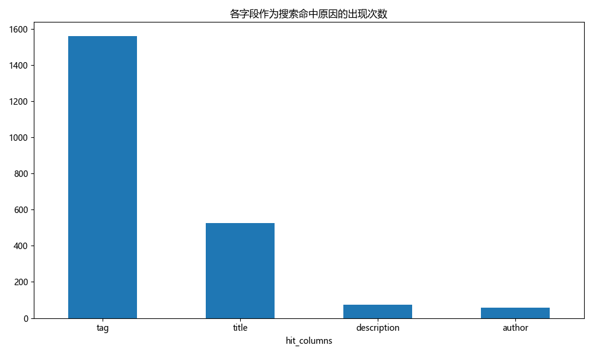</img>
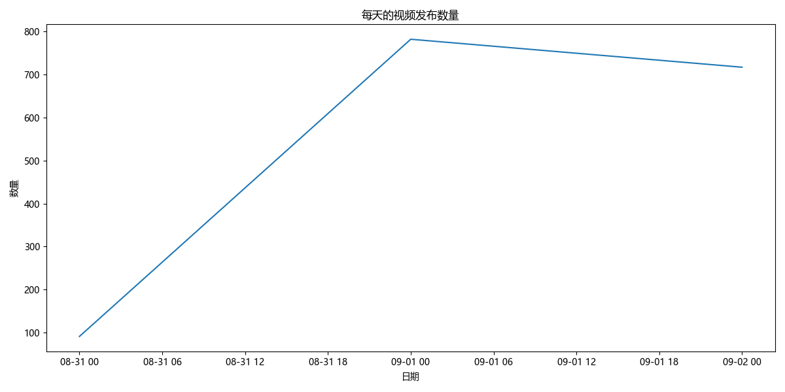</img>
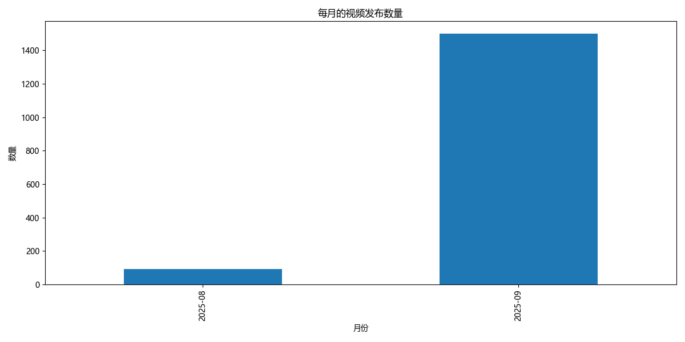</img>
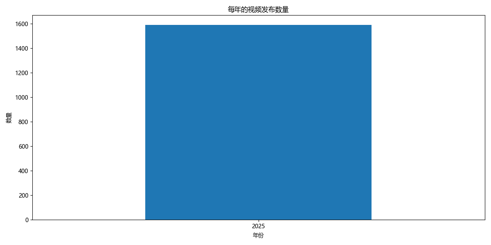</img>
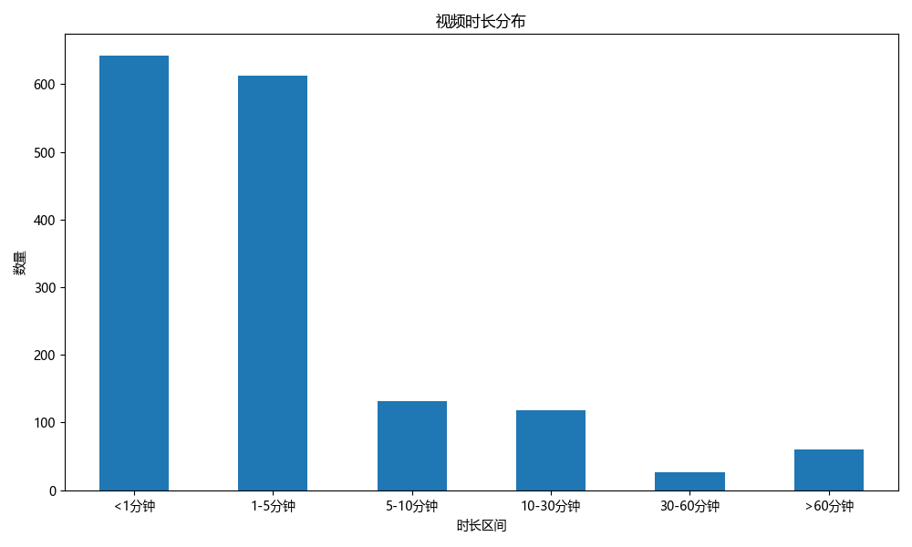</img>
</img>
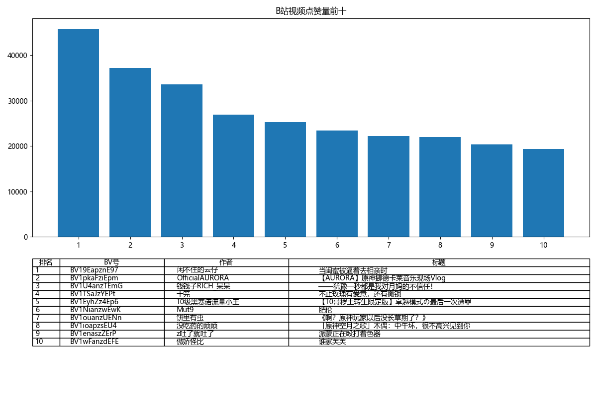</img>
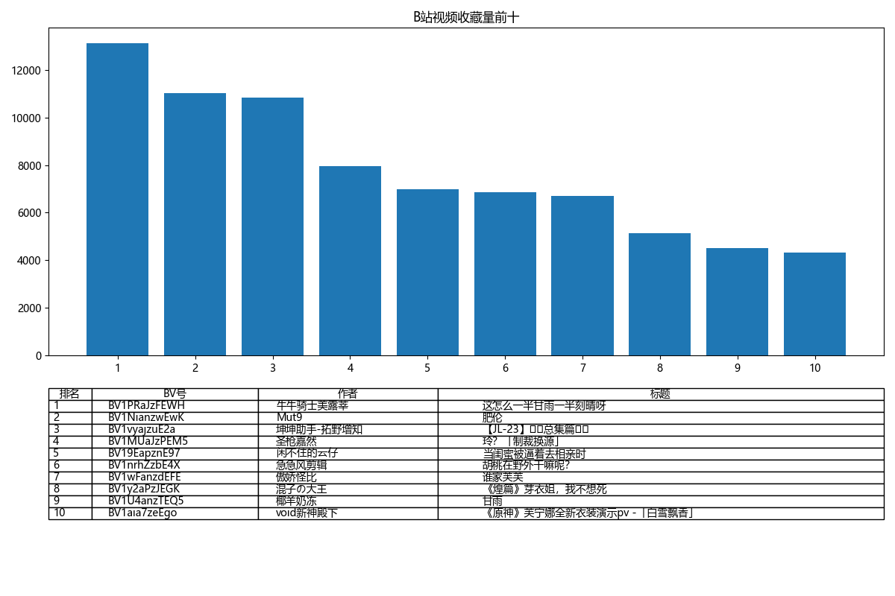</img>
</img>
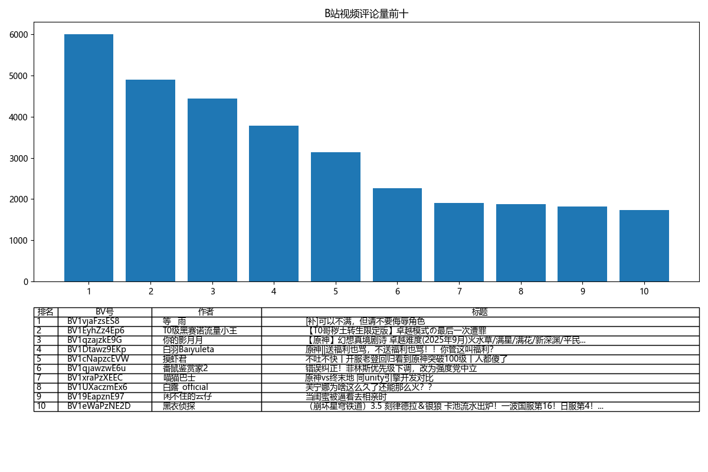</img>
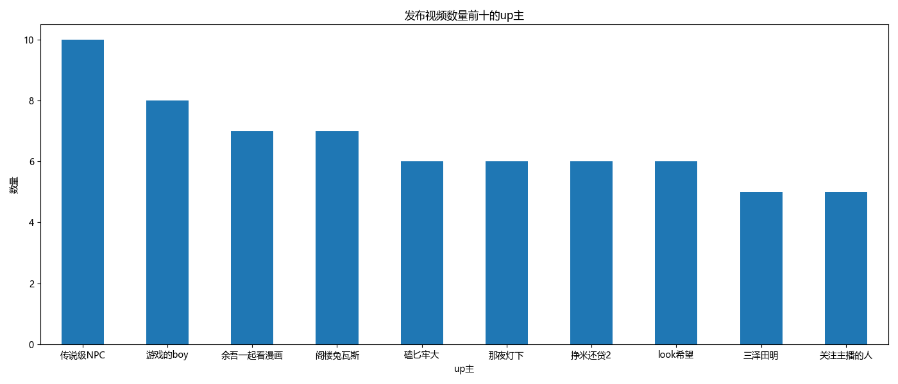</img>
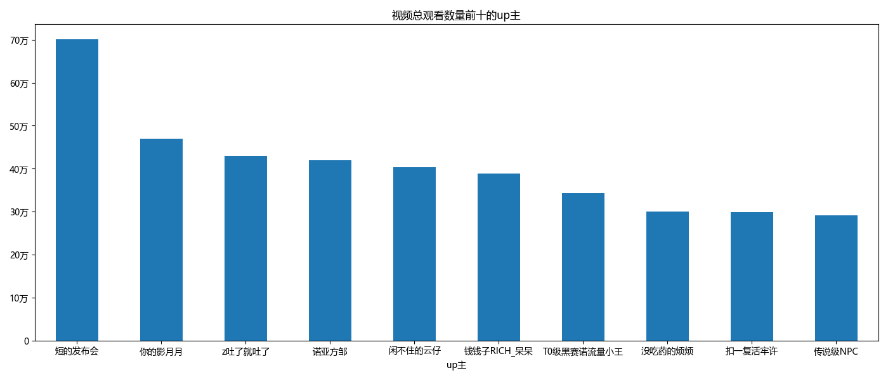</img>
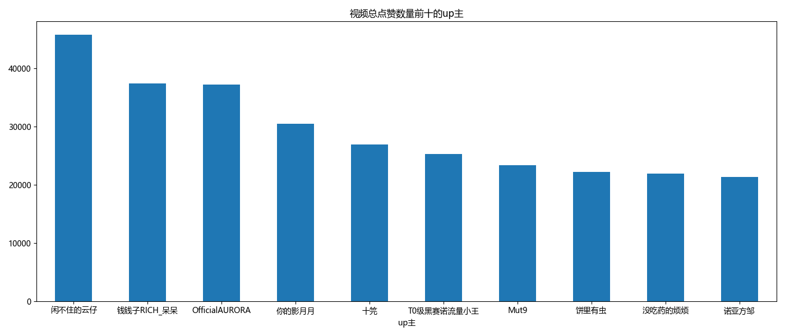</img>
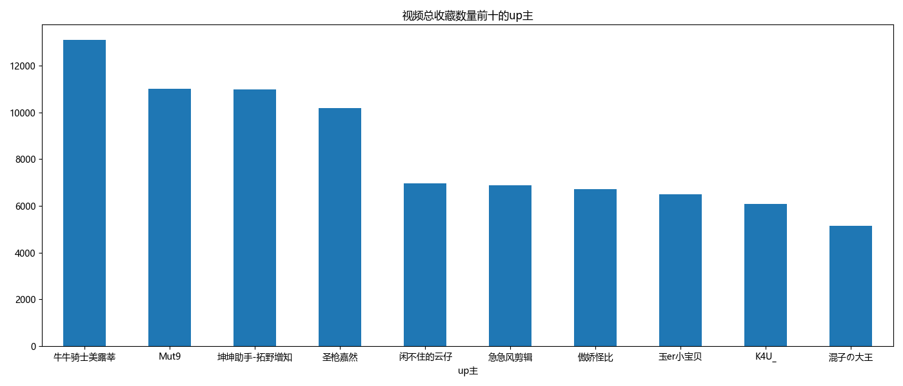</img>
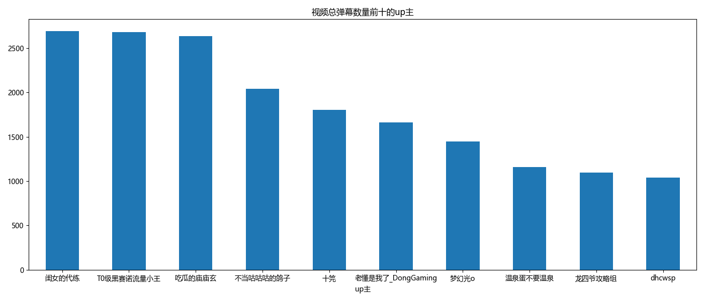</img>
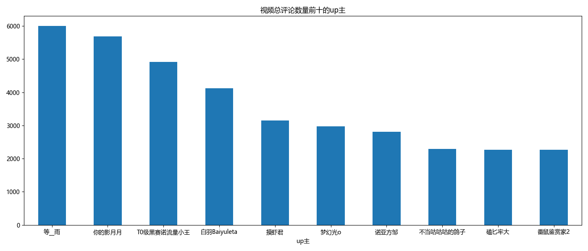</img> 
-->
